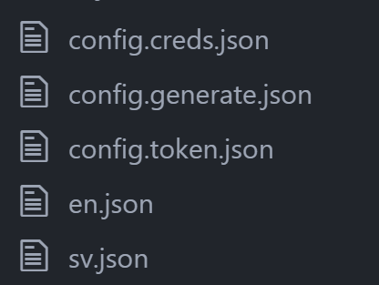

## Googledocs to JSON
- One simple way to sync google rows/columns values to JSON files.


### Install
```bash
$ npm install g2j
```


### Example
- Input

| Key                             | en.json                           | sv.json                                          |
|---------------------------------|-----------------------------------|--------------------------------------------------|
| Car expenses                    | Cost for passenger cars           | Personbilskostnader                              |
| Computers, advertisement and PR | Advertising and PR                | Reklam och PR                                    |
| Building costs                  | Property Cost                     | Fastighetskostnader                              |
| Freight and transport           | Freight and transport             | Frakter och transporter                          |
| Supplies and inventory          | Consumable equipment and supplies | Förbrukningsmaterial och Förbrukningsinventarier |

- Command
```
$ g2j
```

- Output

Two files were created.
en.json and sv.json

```bash
{
  "Car expenses":"Cost for passenger cars",
  "Computers, advertisement and PR":"Advertising and PR",
  "Building costs":"Property Cost",
  "Freight and transport":"Freight and transport",
  "Supplies and inventory":"Consumable equipment and supplies"
}
```


